# Exploring data-set: Categorical Analysis
Olivier PHILIPPE  
26 June 2015  


# Introduction
This survey aims to give a broad picture of research software use and practice within the Research communities in United-Kingdom. 

## Data Collection

The survey contacted 1,000 randomly selected researchers at each of 15 Russell Group universities by email. From this 15,000 invitations to complete the survey, we received 417 responses – a rate of 3% which is a little bit low for a blind survey but can still gives us an idea. 

We asked people specifically about “research software” which we defined as:

>Software that is used to generate, process or analyse results that you intend to appear in a publication (either in a journal, conference paper, monograph, book or thesis). Research software can be anything from a few lines of code written by yourself, to a professionally developed software package. Software that does not generate, process or analyse results - such as word processing software, or the use of a web search - does not count as ‘research software’ for the purposes of this survey.

The responses were collected with Google Forms. 
The data collected during this survey is available for download from Zenodo, as well as the entire code source of the data cleansing and data analysis. It is licensed under a Creative Commons by Attribution licence (attribution to The University of Edinburgh on behalf of the Software Sustainability Institute).


```
##     dataOrigin 
##  NA      :138  
##  petition:143  
##  survey  :418
```
However, the question 6 asked if the participant uses, or not, a software for his research. Considering that people who are not using any software fall out of our category of interest, 
we removed them from the dataset and only perform analysis on the filtered data. 


# Exploring the variables. 

Before seeing the repartition of the variable across categories, it is important to have an overview of each variable at once. It helps to spot possible errors, problems, or over-representativeness. 
The main interest of this research is the understanding of the research community in their use of software and their habit concerning the use, the development and the training of software. 
Therefore, the first variables we are going to visualise are these three variables: 
* The importance of software in research
* The development of software for research
* The corresponding training 


## Habits concerning software in research 

The first interest is to know if people use software for their research. Over our sample of 406 respondents (after data cleaning), 372 of them use a software for their research (92%). 


|   |Use of Software | Total Respondents| Percent|
|:--|:---------------|-----------------:|-------:|
|2  |No              |                37|       5|
|1  |NA              |               138|      20|
|3  |Yes             |               523|      75|

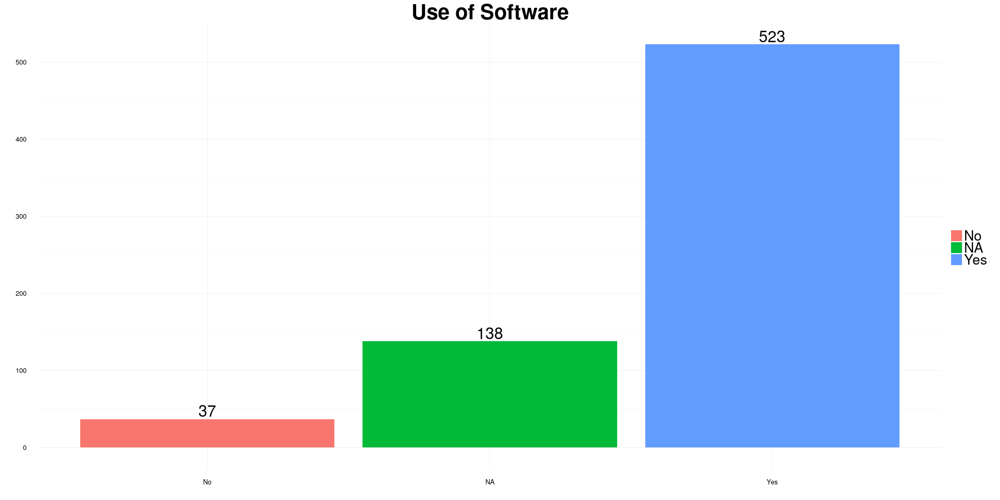<!-- -->

Knowing that only 8% do not use software for research, and as the main point is about people how does use software, we decided to filter these 34 respondents for all further analysis, putting our sample to 372 respondents. 


## Importance of software

The question on the importance of software is a categorical variable with 3 levels.
The possible answers were as follow
* It would make no significant difference to my work
* My work would require more effort, but it would still be possible
* It would not be practical to conduct my work without software 


|   |Importance of Software | Total Respondents| Percent|
|:--|:----------------------|-----------------:|-------:|
|1  |No Difference          |                47|       7|
|3  |More effort            |                98|      14|
|4  |NA                     |               138|      20|
|2  |Not be Practical       |               413|      59|

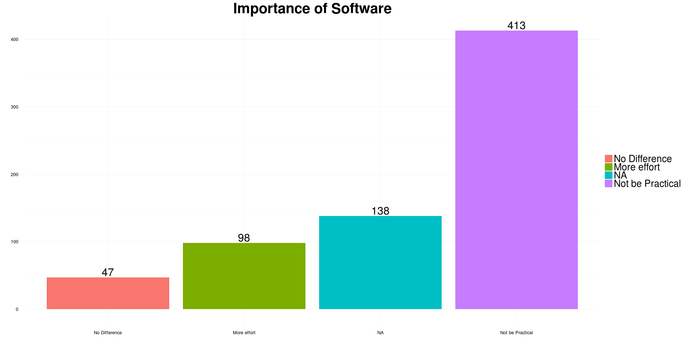<!-- -->

First, it seems that the "No Difference" category is really marginal. We decide to recode this variable into a binary one, representing if the use of software is essential or not. 
The 'Essential' category will include the "Non-Essential" and the "No" category will include the marginal  "No Difference" and the "More effort" 
into two categories "Essential", including the category "No practical" and the other category being "No Essential", including the marginal "No difference" and the "More effort"


|   |Software Essential for research | Total Respondents| Percent|
|:--|:-------------------------------|-----------------:|-------:|
|3  |NA                              |               138|      20|
|1  |No-Essential                    |               145|      21|
|2  |Essential                       |               413|      59|

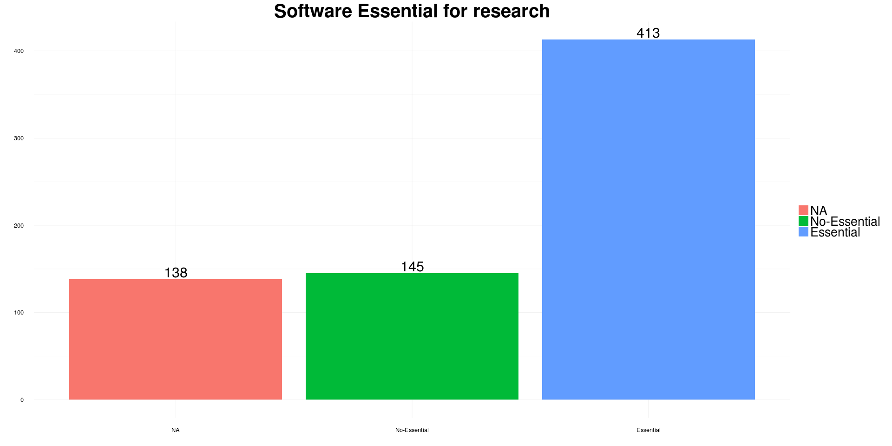<!-- -->

## Developing its own research software.

It’s not just proprietary software, many researchers are developing their own code: 56% of them. This is great news, because the real power of software lies in developing it to allow you to do more in less time and make new research possible.


|Developing Software | Total Respondents| Percent|
|:-------------------|-----------------:|-------:|
|NA                  |               138|      20|
|No                  |               198|      28|
|Yes                 |               362|      52|

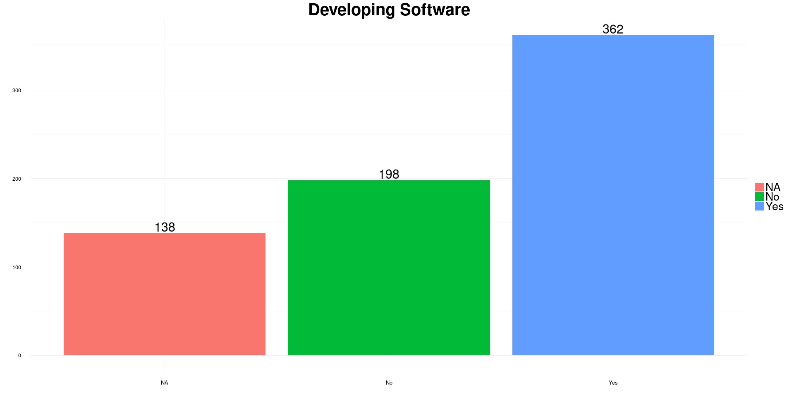<!-- -->

### Training to develop software


|   |Training in Software development | Total Respondents| Percent|
|:--|:--------------------------------|-----------------:|-------:|
|5  |Taught                           |                85|      12|
|4  |Self-taugh+Taught                |               120|      17|
|1  |NA                               |               139|      20|
|3  |Self-Taught                      |               150|      21|
|2  |No                               |               205|      29|

```
## [1] Taught            Self-taugh+Taught NA                Self-Taught      
## [5] No               
## Levels: Taught < Self-taugh+Taught < NA < Self-Taught < No
```

```
## Warning in if (is.na(ownColour) == FALSE) {: the condition has length > 1
## and only the first element will be used
```

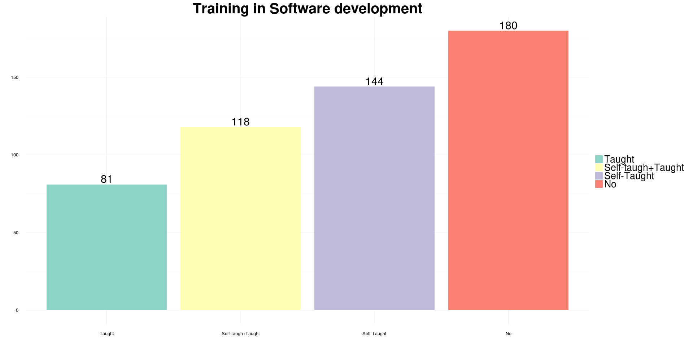<!-- -->


### Training versus developing


|   |Training in Software development | Total Respondents| Percent|
|:--|:--------------------------------|-----------------:|-------:|
|1  |NA                               |                 0|       0|
|2  |No                               |                60|      17|
|5  |Taught                           |                68|      19|
|4  |Self-taugh+Taught                |               108|      30|
|3  |Self-Taught                      |               126|      35|

```
## Warning in if (is.na(ownColour) == FALSE) {: the condition has length > 1
## and only the first element will be used
```

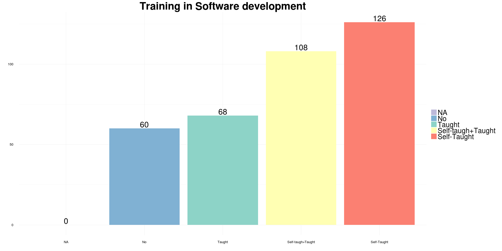<!-- -->


## Additional informations


### Disciplines

If we output the frequency of distribution we obtain the following table.


|   |Discipline                                        | Total Respondents| Percent|
|:--|:-------------------------------------------------|-----------------:|-------:|
|5  |Design, creative & performing arts                |                 2|       0|
|11 |None of the above                                 |                 4|       1|
|3  |Architecture & planning                           |                 6|       1|
|1  |Administrative & business studies                 |                 8|       1|
|2  |Agriculture, forestry & veterinary science        |                 8|       1|
|6  |Education                                         |                 9|       1|
|8  |Humanities & language based studies & archaeology |                42|       6|
|12 |Social studies                                    |                51|       7|
|9  |Medicine, dentistry & health                      |                60|       9|
|7  |Engineering & technology                          |               114|      16|
|10 |NA                                                |               138|      20|
|4  |Biological, mathematical & physical sciences      |               256|      37|

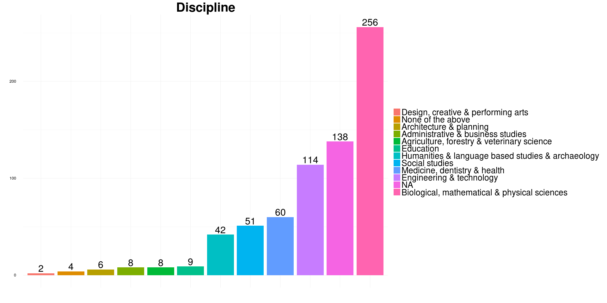<!-- -->

As we can see, several categories has a really low number of members. The decision to bring different disciplines together is always a difficult decision and will never satisfy all academics on the same time. From this first, an already controversial, aggregate, we decided to sum several of these categories together to avoid almost empty groups for the futures cross-tabulations analysis. 
We decided to merge the following categories based on the low level of each and an attempt to group them on a common sense:

* Design, creative & performing arts + Architecture & planning + Humanities & language based studies & archaeology
* Administrative & business studies + Social studies + Education
* Medicine, dentistry & health + Agriculture, forestry & veterinary science


Then the distribution table seems more usable even if we probably make more academics angry at this point. 


|Modified Disciplines                         | Total Respondents| Percent|
|:--------------------------------------------|-----------------:|-------:|
|None of the above                            |                 4|       1|
|Design+Art+Hum                               |                50|       7|
|Admin+Social+Edu                             |                68|      10|
|Medicine+Agri                                |                68|      10|
|Engineering & technology                     |               114|      16|
|NA                                           |               138|      20|
|Biological, mathematical & physical sciences |               256|      37|

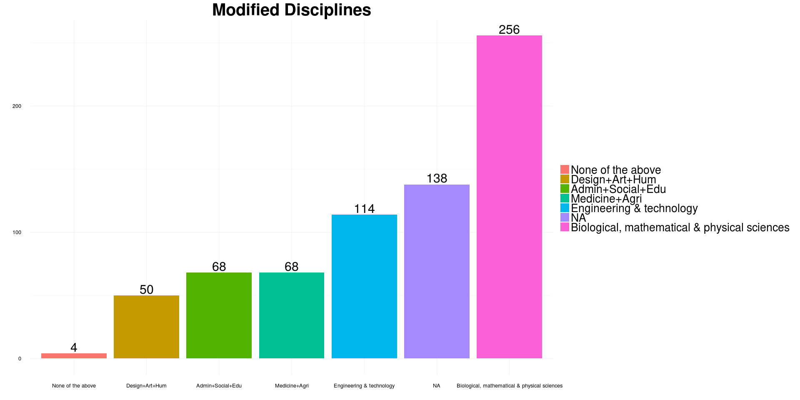<!-- -->


### Importance of software per disciplines

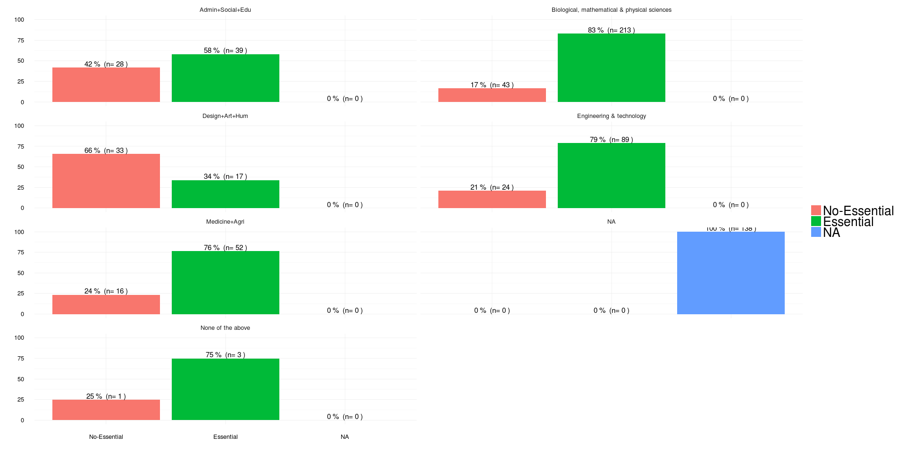<!-- -->

### Developing software per disciplines

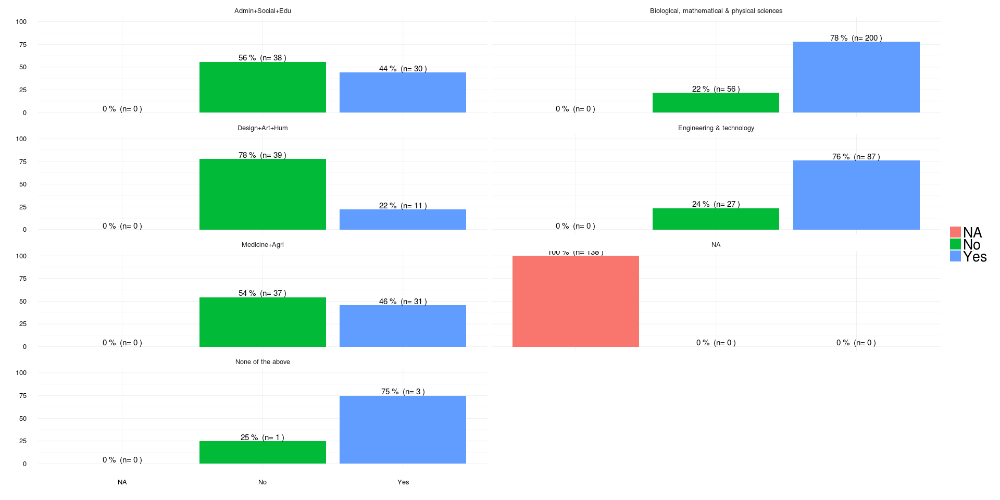<!-- -->

### Developing software per disciplines

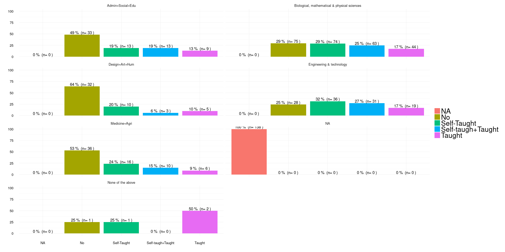<!-- -->

## Funding Origins

The questions 4 about the funds already been cleaned up during the previous process, some data entered in the free text zone have been recoded in a reduced numbers of factors. At the end we obtain 20 categories. 

The frequencies distribution is showed on the following table and plot. We can see that there is a high representation of people from EPSRC in the sample (23%).


|Funds                                                          | Total Respondents| Percent|
|:--------------------------------------------------------------|-----------------:|-------:|
|DEL                                                            |                 1|       0|
|Google                                                         |                 1|       0|
|I am not in the UK                                             |                 1|       0|
|I'm not in the UK                                              |                 1|       0|
|Iraq Ministry of Higher Education                              |                 1|       0|
|KTP                                                            |                 1|       0|
|Me                                                             |                 1|       0|
|Not applicable                                                 |                 1|       0|
|not UK                                                         |                 1|       0|
|Queen Mary University of London                                |                 1|       0|
|School                                                         |                 1|       0|
|No funding                                                     |                 2|       0|
|Self funded                                                    |                 3|       0|
|Leverhulme Trust                                               |                 6|       1|
|Non-UK Gov                                                     |                 6|       1|
|Insufficient information                                       |                10|       2|
|Other UK Gov                                                   |                10|       2|
|AHRC - Arts and Humanities Research Council                    |                11|       2|
|Wellcome Trust                                                 |                14|       2|
|National Institute for Health Research                         |                15|       2|
|Industry                                                       |                17|       3|
|STFC - Science and Technology Facilities Council               |                18|       3|
|BBSRC - Biotechnology and Biological Sciences Research Council |                19|       3|
|NERC - Natural Environment Research Council                    |                21|       3|
|MRC - Medical Research Council                                 |                24|       4|
|Other charity or fundation                                     |                24|       4|
|ESRC - Economic and Social Research Council                    |                31|       5|
|Don't know                                                     |                36|       6|
|Europe                                                         |                36|       6|
|University central funds                                       |                56|       9|
|EPSRC - Engineering and Physical Sciences Research Council     |               110|      18|
|NA                                                             |               138|      22|

The number of categories for this variable is too big to apply a pertinent comparison between them. We decide to recode the 20 categories into 7. 

* **Charity/Trust**: "Leverhulme Trust" - "Other charity or foundation" - "Wellcome Trust"
* **Research Councils**: "AHRC - Arts and Humanities Research Council" - "BBSRC - Biotechnology and Biological Sciences Research Council" - "EPSRC - Engineering and Physical Sciences Research Council" - "ESRC - Economic and Social Research Council" - "NERC - Natural Environment Research Council" - "STFC - Science and Technology Facilities Council"
* **Industry**: "Industry"
* **Other UK**: "Other UK Gov" - "University central funds" - "National Institute for Health Research"
* **Others Non-UK**: "Non-UK Gov" - "Europe"
* **None**: "Don't know" - "Insufficient information" - "No funding" - "Self funded"

These categories represents a meta-categories of units. They were build under a common sense logic to help further analysis. As soon as a global picture is obtained, we will do within-categories cross-tabulation analysis. Here following the creation of these categories


|Modified Funds                                   | Total Respondents| Percent|
|:------------------------------------------------|-----------------:|-------:|
|Not applicable                                   |                 1|       0|
|not UK                                           |                 1|       0|
|Queen Mary University of London                  |                 1|       0|
|School                                           |                 1|       0|
|No funding                                       |                 2|       0|
|Self funded                                      |                 3|       0|
|Non-UK Gov                                       |                 6|       1|
|Other UK Gov                                     |                10|       2|
|Wellcome Trust                                   |                14|       2|
|National Institute for Health Research           |                15|       2|
|Other UK                                         |                18|       3|
|STFC - Science and Technology Facilities Council |                18|       3|
|Other charity or fundation                       |                24|       4|
|None                                             |                27|       4|
|Charity/Trust                                    |                28|       5|
|Other Non-UK                                     |                32|       5|
|Europe                                           |                36|       6|
|University central funds                         |                56|       9|
|Research Council                                 |               325|      53|

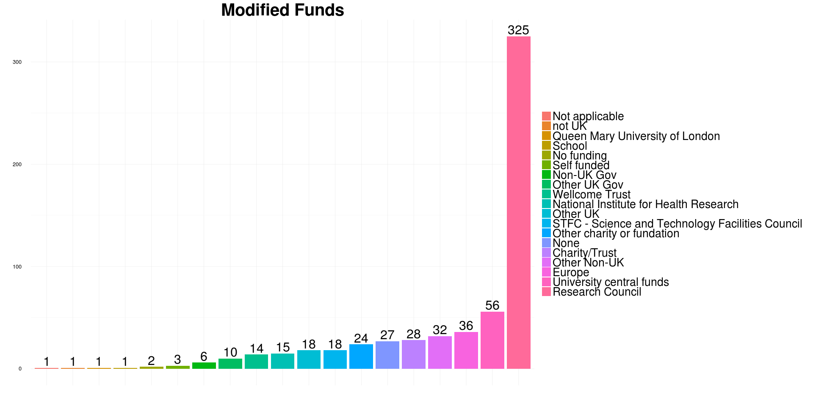<!-- -->

We have two types of researcher funding in our sample, one type that is funded by a Research council (52%) and one half with other type of funding. We keep or current categorisation for further analysis. 

### Importance of software per funding origin

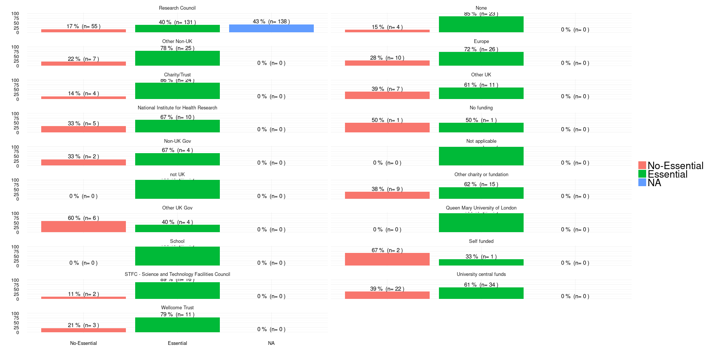<!-- -->

### Developing software per funding origin 
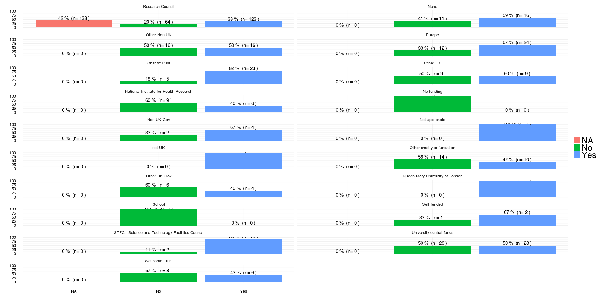<!-- -->

### Training software per funding origin 
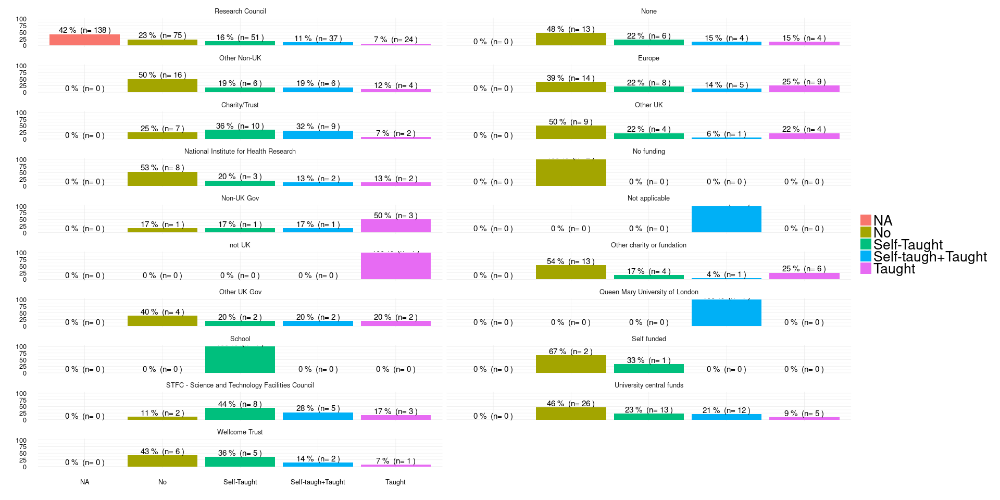<!-- -->

### Seniority


First, we take a look at the variable Seniority. This is an ordinal variable with 6 levels:
* Less than a year
* 1-5 years
* 6-10 years
* 11-15 years
* 15-20 years
* More than 20 years
We need to recode the levels of the factor for later graphics


And now to visualise the repartition of our sample within the Seniority variable.


|Seniority          | Total Respondents| Percent|
|:------------------|-----------------:|-------:|
|Less than a year   |                15|       3|
|1-5 years          |               181|      32|
|6-10 years         |               141|      25|
|11-15 years        |                78|      14|
|15-20 years        |                49|       9|
|More than 20 years |                93|      17|

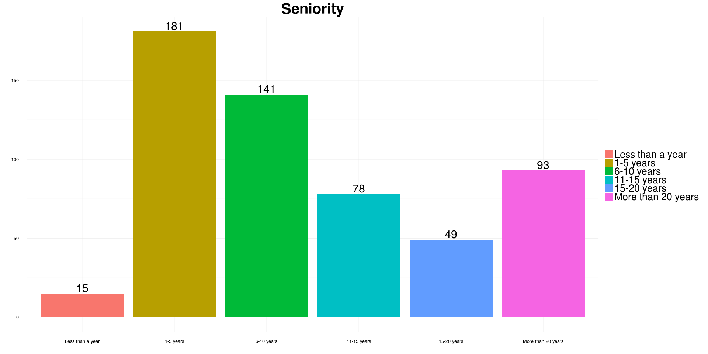<!-- -->

### Importance of software per Seniority

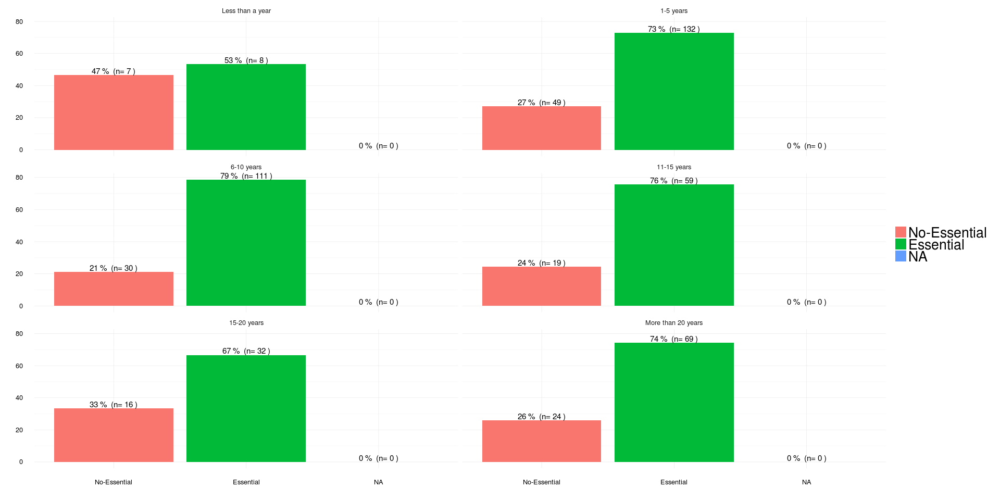<!-- -->

### Developing software per Seniority 
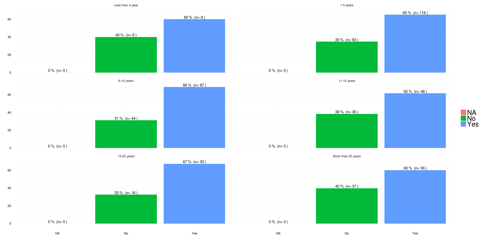<!-- -->

### Training software per Seniority 
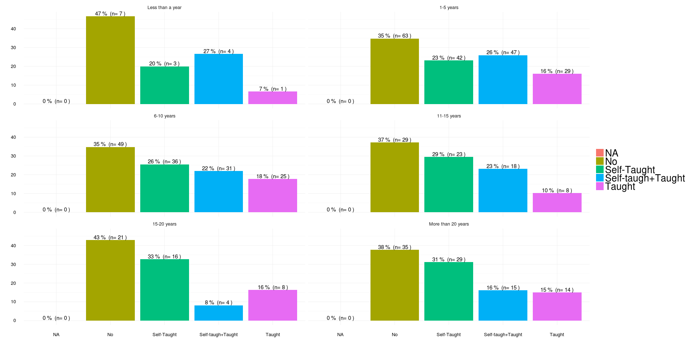<!-- -->

## Gender


|   |Gender | Total Respondents| Percent|
|:--|:------|-----------------:|-------:|
|4  |Other  |                 3|       0|
|3  |NA     |               149|      22|
|1  |Female |               174|      25|
|2  |Male   |               366|      53|

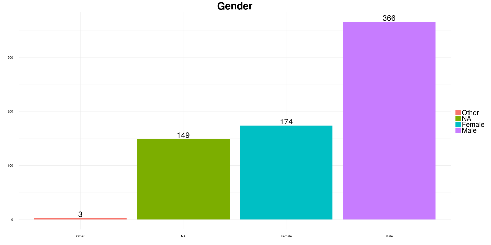<!-- -->

### Importance of software per Gender

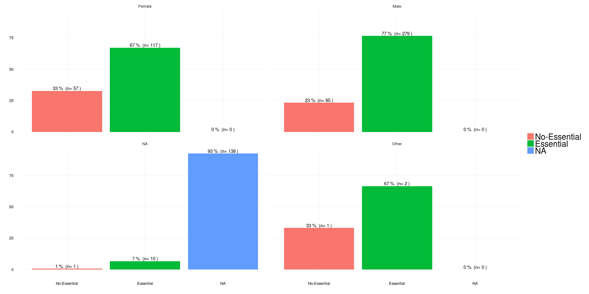<!-- -->

### Developing software per Gender

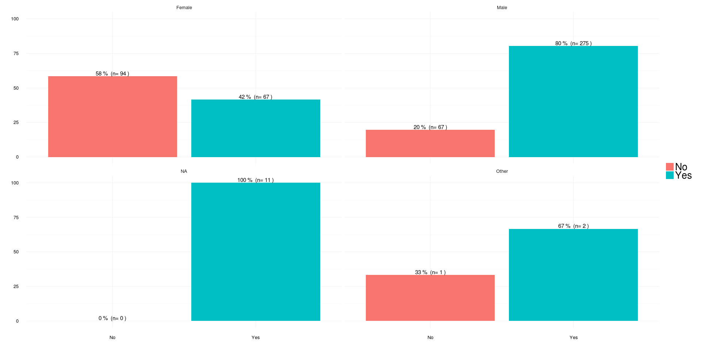<!-- -->

### Training software per Gender

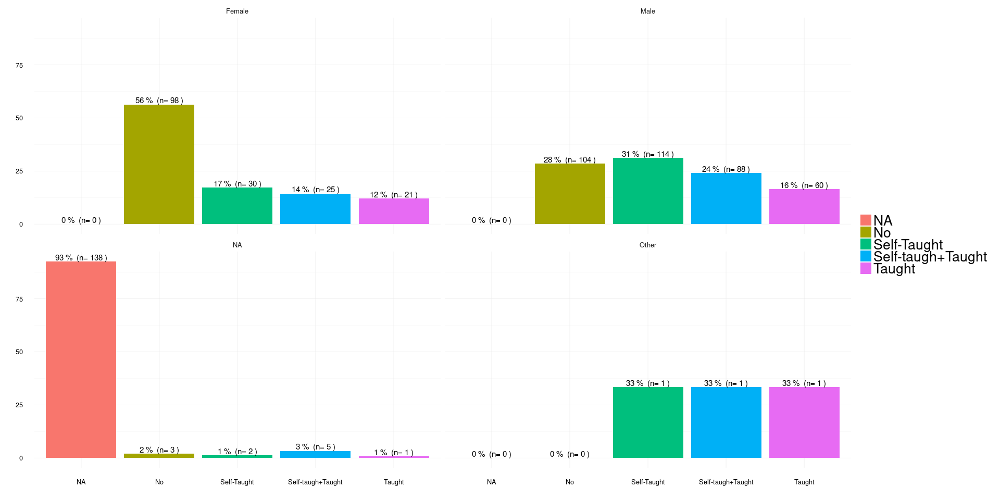<!-- -->

## Operating System


|   |Operating System        | Total Respondents| Percent|
|:--|:-----------------------|-----------------:|-------:|
|1  |Don't have a preference |                62|       9|
|3  |Mac OS X                |               134|      19|
|2  |GNU/Linux               |               142|      20|
|5  |NA                      |               151|      22|
|4  |Microsoft Windows       |               210|      30|

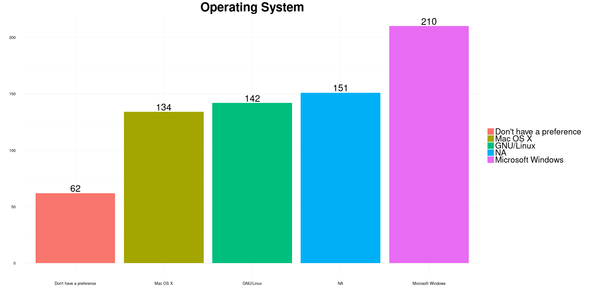<!-- -->
### Importance of software per Operating System

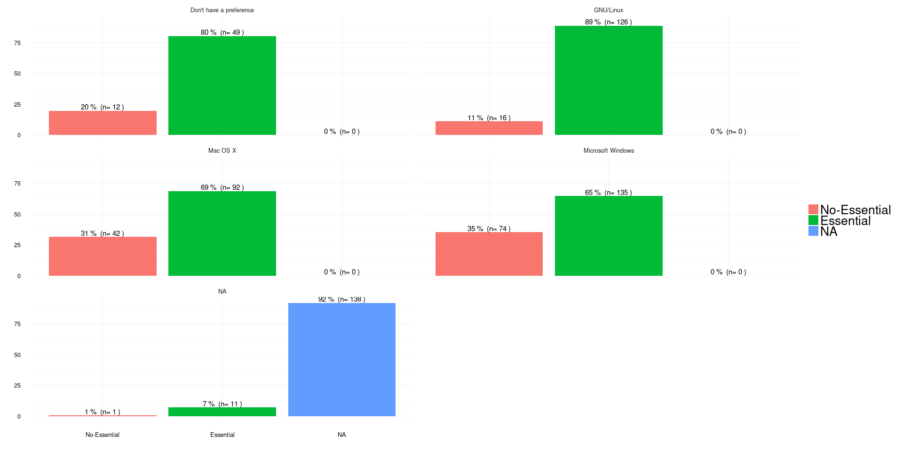<!-- -->

### Developing software per Operating System

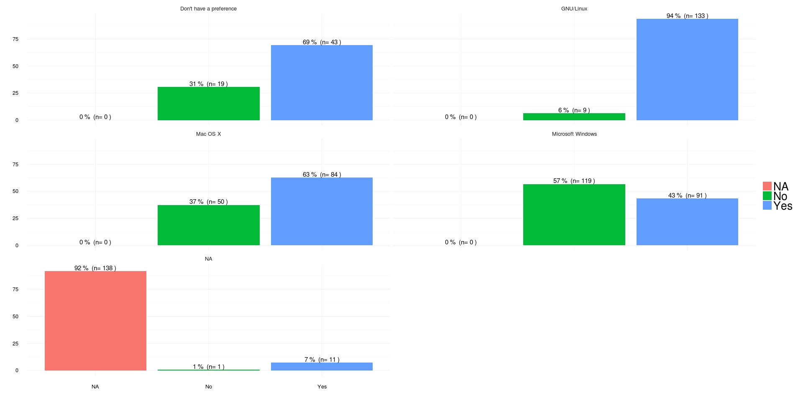<!-- -->

### Training software per Operating System

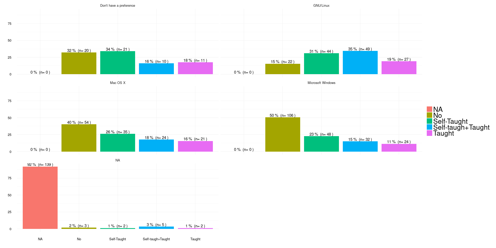<!-- -->
